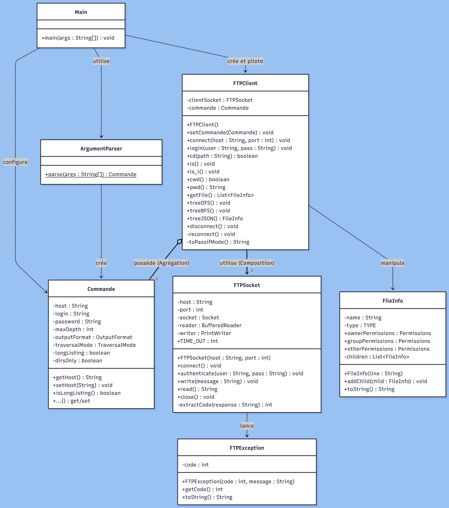
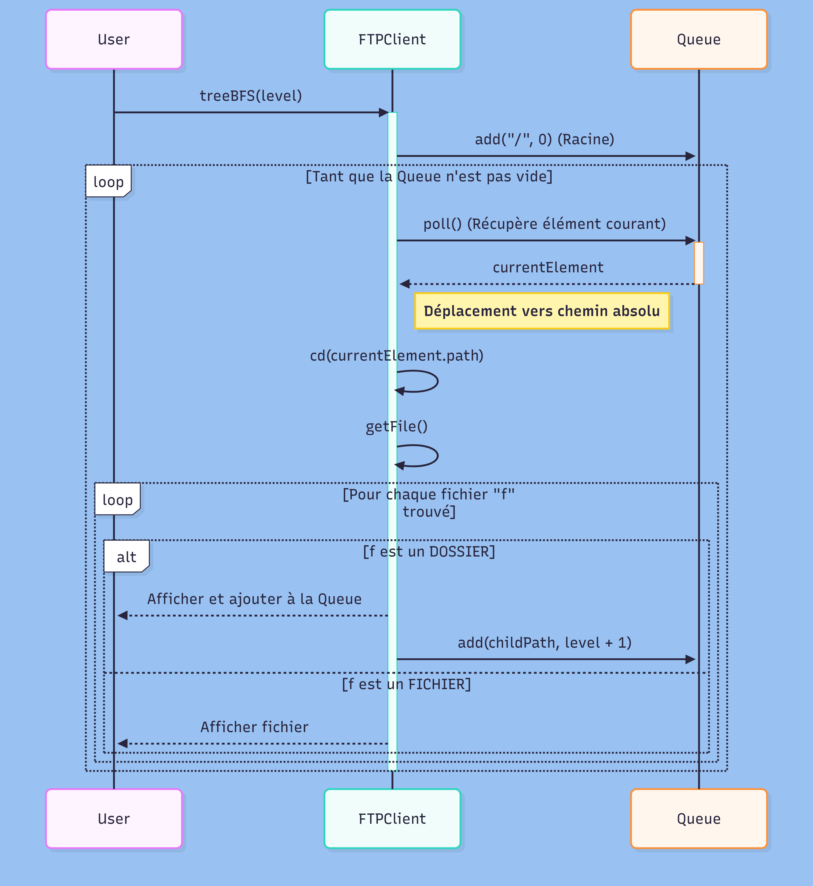
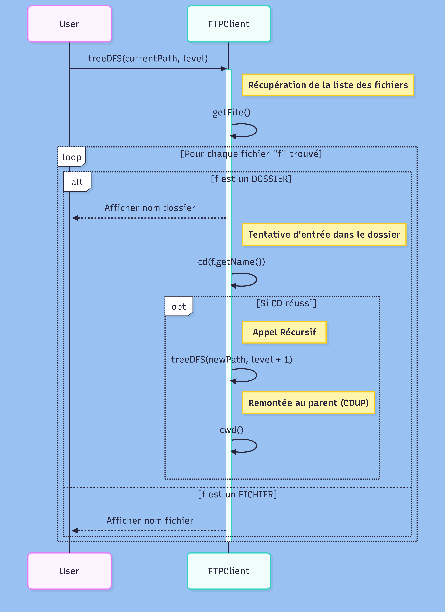
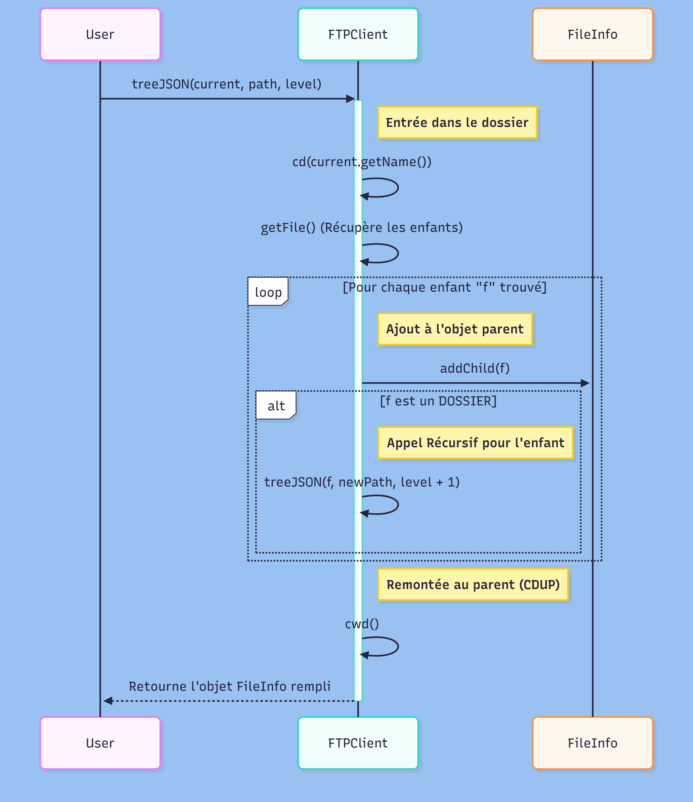

# Client FTP
Assane Kane
24/01/2026

## Introduction
Ce logiciel est un client FTP en ligne de commande développé en Java. Il permet de se connecter à un serveur distant pour naviguer dans les dossiers et lister les fichiers. La fonctionnalité principale réside dans l'exploration récursive de l'arborescence du serveur selon deux algorithmes distincts : le parcours en profondeur (DFS) et le parcours en largeur (BFS). Le logiciel offre également la possibilité d'exporter la structure des fichiers au format JSON.

## Instructions de build et d'exécution

### Compilation avec Maven

Pour empaqueter le projet, exécutez les commandes suivantes :

```bash
mvn clean package
```

Cette commande génère un fichier JAR exécutable dans le dossier `target/`.

### Exécution du programme

Pour lancer le projet avec les paramètres par défaut :

```bash
java -jar target/TreeFTP.jar  [login] [password] [OPTIONS]
```

### Tests unitaires

Le projet utilise JUnit 5 et Mockito pour les tests unitaires.


Les tests couvrent l'ensemble des fonctionnalités de la classe `FTPClient` :

**Tests de connexion et authentification :**
- `connectAndLogin()` : Vérifie la séquence complète de connexion et d'authentification (codes 220, 331, 230)

**Tests de navigation :**
- `cdSuccess()` : Teste le changement de répertoire réussi (code 250)
- `cdFailure()` : Teste le changement de répertoire échoué (code 550)
- `cwd()` : Teste la remontée au répertoire parent avec CDUP
- `pwd()` : Teste l'extraction du chemin courant depuis la réponse PWD

**Tests de listage :**
- `ls()` : Teste le listing simple (NLST) avec mock du socket de données
- `ls_l()` : Teste le listing détaillé (LIST)
- `getFiles()` : Teste la récupération et le parsing complet des métadonnées de fichiers

**Tests de fermeture :**
- `disconnect()` : Vérifie la fermeture propre du socket

Les tests utilisent des **mocks Mockito** pour simuler le comportement du serveur FTP sans nécessiter de connexion réseau réelle. Le pattern `MockedConstruction` est utilisé pour mocker la création dynamique des sockets de données en mode passif.

**Exemples d'utilisation :**

```bash
# Connexion anonyme avec affichage simple (ls)
java -jar target/TreeFTP.jar ftp.ubuntu.com anonymous anonymous

# Export JSON de l'arborescence
java -jar target/TreeFTP.jar ftp.ubuntu.com anonymous pass -o json

# Parcours en largeur avec profondeur limitée
java -jar target/TreeFTP.jar ftp.debian.org anonymous pass --bfs -d 3

# Affichage détaillé (permissions, taille)
java -jar target/TreeFTP.jar ftp.example.com user pass -l
```

**Options disponibles :**

- `-d, --depth <N>` : Profondeur maximale d'exploration
- `-o, --output <format>` : Format de sortie (json)
- `--bfs` : Parcours en largeur
- `--dfs` : Parcours en profondeur (par défaut)
- `--dirs-only` : Afficher uniquement les répertoires
- `-l` : Affichage détaillé 
- `--help` : Afficher l'aide


## Architecture

### Classes principales

**FTPClient** : Classe métier centrale gérant la logique de communication avec le serveur FTP. Elle orchestre les commandes de navigation (CWD, CDUP, PWD), de listage (LIST, NLST) et implémente les algorithmes de parcours d'arborescence.

**FTPSocket** : Couche d'abstraction réseau encapsulant la connexion TCP bas niveau avec le serveur. Gère les flux d'entrée/sortie, les timeouts et l'authentification.

**FTPParser** : Classe utilitaire responsable du parsing des réponses FTP. Contient plusieurs classes internes statiques pour représenter les informations extraites (FileInfo, FtpConnectionInfo, Permissions).

**Commande** : Objet de configuration immutable stockant les paramètres d'exécution (hôte, credentials, format de sortie, mode de parcours).

**ArgumentParser** : Analyseur de ligne de commande convertissant le tableau de chaînes `String[] args` en objet `Commande` typé.

**FTPException** : Exception personnalisée encapsulant les codes d'erreur FTP (530, 550, etc.) et les messages associés.

### Énumérations

**Commande.OutputFormat** : Définit les formats de sortie supportés (TEXT, JSON).

**Commande.TraversalMode** : Spécifie le mode de parcours de l'arborescence (DFS, BFS).

**FTPParser.TYPE** : Type d'élément du système de fichiers (DIRECTORY, FILE, SYMBOLIC_LINK, UNKNOWN).


### Méthodes polymorphiques

Le projet utilise le polymorphisme à plusieurs niveaux pour assurer la flexibilité et l'extensibilité du code :

**Polymorphisme par énumération** : Les enums `OutputFormat` et `TraversalMode` permettent une sélection dynamique de la stratégie de traitement dans la classe `Main`. La méthode appelée (treeDFS, treeBFS, treeJSON) varie selon la valeur de l'énumération.

**Surcharge de méthodes** : La classe `FileInfo` implémente deux versions de `toString()` : une version publique sans paramètre et une version privée `toString(int level)` pour l'affichage récursif avec indentation variable.

**Collections polymorphes** : La méthode `getFile()` retourne une `List<FileInfo>` qui est utilisée de manière polymorphe dans différents contextes (DFS récursif, BFS itératif, construction JSON).

**Traitement uniforme** : Grâce au pattern Composite, les fichiers et dossiers (tous représentés par `FileInfo`) sont traités de manière uniforme dans les algorithmes de parcours, avec une différenciation basée sur le type via l'énumération `TYPE`.


## Diagrammes UML

Le projet est documenté par un diagramme de classes et trois diagrammes de séquence illustrant les portions de code les plus critiques.

### Diagramme de classes

Le diagramme de classes présente l'architecture globale du système avec les relations entre les composants principaux.




### Diagramme de séquence - Parcours en largeur (BFS)

Le diagramme illustre l'algorithme de parcours BFS avec utilisation d'une `Queue` pour explorer niveau par niveau.




### Diagramme de séquence - Parcours en profondeur (DFS)

Le diagramme montre l'algorithme récursif DFS avec navigation dans les dossiers et remontée au parent.




### Diagramme de séquence - Export JSON

Le diagramme présente la construction récursive de la structure JSON avec pattern Composite.




## Design Patterns

Le projet implémente plusieurs design patterns classiques pour assurer une architecture modulaire et maintenable.

### Façade - FTPClient

La classe `FTPClient` agit comme une façade qui simplifie l'interface complexe du sous-système FTP. Elle fournit une interface unifiée pour les opérations de bas niveau (gestion des sockets, parsing des réponses, algorithmes de parcours).

```java
// FTPClient encapsule la complexité du système FTP
FTPClient client = new FTPClient();
    client.setCommande(commande);


    // Connexion
    client.connect(commande.getHost(), 21);
    client.login(commande.getLogin(), commande.getPassword());


    if (commande.getOutputFormat() == Commande.OutputFormat.JSON) {
        FTPParser.FileInfo tree = client.treeJSON();
    ...
        client.treeDFS();
    ...
        client.treeBFS();
    ...
        client.ls_l();
    ...
    }
```

### Composite - Structure hiérarchique des fichiers

La classe `FileInfo` implémente le pattern Composite en permettant de représenter à la fois des fichiers individuels et des dossiers contenant d'autres éléments. Cette structure récursive est essentielle pour l'export JSON.

```java
// Structure Composite : FileInfo peut contenir d'autres FileInfo
public static class FileInfo {
  private List children; // Composants fils
  
  public void addChild(FileInfo child) {
    if (this.children != null) {
      this.children.add(child);
    }
  }
}
```


## Code Samples


### Parsing du mode passif FTP avec extraction par regex

Le mode passif (PASV) retourne une réponse formatée contenant l'IP et le port du serveur de données. Cette méthode extrait ces informations en utilisant une expression régulière pour capturer les 6 nombres entre parenthèses, puis calcule le port final avec la formule `port = (p5 * 256) + p6`.

```java
public static FtpConnectionInfo calculerIpEtPort(String message) {
    // Extraire uniquement la partie entre parenthèses
    // On utilise une expression régulière pour capturer les 6 nombres
    Pattern pattern = Pattern.compile("\\((\\d+,\\d+,\\d+,\\d+,\\d+,\\d+)\\)");
    Matcher matcher = pattern.matcher(message);

    if (matcher.find()) {
        String contenu = matcher.group(1); // Ex: "212,27,60,27,109,180"
        String[] parties = contenu.split(",");

        String ip = parties[0] + "." + parties[1] + "." + parties[2] + "." + parties[3];

        // 3. Calculer le port
        int p5 = Integer.parseInt(parties[4]);
        int p6 = Integer.parseInt(parties[5]);
        int port = (p5 * 256) + p6;

        return new FtpConnectionInfo(ip, port);
    }

    return null; // Ou lever une exception si le format est mauvais
}
```

### Parcours en largeur (BFS) avec file d'attente

Le parcours BFS utilise une `Queue<QueueElement>` pour explorer l'arborescence niveau par niveau. Chaque élément de la queue contient le chemin et la profondeur courante. La boucle principale dépile les éléments, change de répertoire, récupère les fichiers et ajoute les sous-dossiers à la queue.

```java
public void treeBFS(int level) throws IOException{
    int maxDepth = this.commande.getMaxDepth();

    Queue<FTPParser.QueueElement> queue = new LinkedList<>();
    queue.add(new FTPParser.QueueElement("/", 0));

    //gestion panne réseau
        if (!this.cd(current.path)) break;
        String indatation = " ".repeat(level);
        System.out.println(indatation + "└──" + current);

        List<FTPParser.FileInfo> files = this.getFile();

        for (FTPParser.FileInfo f : files) {
            String name = f.getName();
            if (".".equals(name) || "..".equals(name)) continue;

            if (this.commande.isDirsOnly() && f.getType() != FTPParser.TYPE.DIRECTORY) {
                continue; // On n'affiche pas les fichiers
            }

            if (f.getType() == FTPParser.TYPE.DIRECTORY) {
                System.out.println(indatation + "  └──" + name);

                String separator = current.path.endsWith("/") ? "" : "/";
                String childPath = current.path + separator + name;
                queue.add(new FTPParser.QueueElement(childPath, current.level + 1));

            } else {
                System.out.println(indatation + "  ├──" + name);
            }
        }
    // gestion panne

}
```

### Mécanisme de reconnexion automatique après perte de connexion

Cette méthode implémente un pattern de résilience en cas de perte de connexion réseau. Elle ferme proprement l'ancien socket, crée une nouvelle instance de `FTPSocket`, ré-établit la connexion TCP et ré-authentifie l'utilisateur avec les credentials stockés dans l'objet `Commande`.

```java
private void reconnect() throws IOException {
  System.out.println(">>Connection perdu. Tentative de reconnection...");
  
  try {
    this.disconnect(); // Fermeture propre de l'ancien socket
  } catch (IOException e) {
    // Ignore si déjà fermé
  }
  
  // Création d'un nouveau socket
  FTPSocket tmpSocket = new FTPSocket(commande.getHost(), 21);
  tmpSocket.connect();
  
  this.clientSocket = tmpSocket;
  // Ré-authentification avec les credentials sauvegardés
  this.login(commande.getLogin(), commande.getPassword());
}
```


### Boucle de retry avec gestion d'erreur pour la récupération de fichiers

Cette boucle implémente un pattern de résilience avec trois tentatives maximum. En cas d'échec de `getFile()`, elle attend 2 secondes, tente une reconnexion, restaure le contexte (navigation vers le dossier courant) puis réessaie. Ce mécanisme évite l'abandon prématuré en cas d'erreur réseau transitoire.

```java
try {
    // RÉCUPÉRATION DES FICHIERS (Retry Loop)
    // Maintenant qu'on est dedans, si getFile rate, on doit revenir à currentPath
    List<FTPParser.FileInfo> children = new ArrayList<>();
    boolean listed = false;
    retries = 0;

    while (!listed && retries < 3) {
        try {
            children = this.getFile();
            listed = true;
        } catch (IOException e) {
            retries++;
            System.err.println("Erreur Listing JSON (" + e.getMessage() + "). Réparation...");
            try { Thread.sleep(1000); } catch (InterruptedException ignored) {}

            try {
                this.reconnect();
                // RECOVERY : On doit revenir DANS le dossier courant
                if (!this.cd(currentPath)) {
                    throw new IOException("Impossible de restaurer " + currentPath);
                }
            } catch (IOException ignored) {}
        }
    }
}
```

## Dépendances

### Dépendances de production

**Gson 2.13.1** : Bibliothèque Google pour la sérialisation/désérialisation JSON. Utilisée pour l'export de l'arborescence au format JSON avec l'annotation `@Expose`.

```xml

  com.google.code.gson
  gson
  2.13.1
  compile

```

### Dépendances de test

**JUnit Jupiter 6.1.0-M1** : Framework de tests unitaires pour Java.

```xml

  org.junit.jupiter
  junit-jupiter-api
  6.1.0-M1
  test

```

**Mockito Core 5.21.0** : Framework de mock pour les tests unitaires, permettant de simuler le comportement des dépendances externes (sockets, serveurs FTP).

```xml

  org.mockito
  mockito-core
  5.21.0
  test

```

**Mockito JUnit Jupiter 5.21.0** : Intégration de Mockito avec JUnit 5.


## Limites et améliorations possibles

- Les liens symboliques sont détectés mais non suivis lors du parcours
- définition d'un attribut dataSocket dans la classe FTPClient pour les requêtes de données
- gestion des pannes sur toute commande/algorithme faisant appel au réseau.


